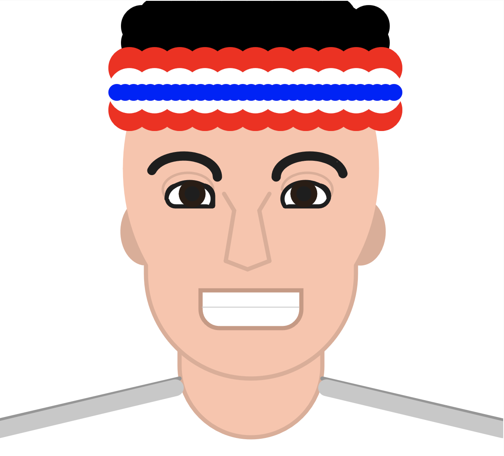

# Yankun's Creative Coding Gallery

My definition of creative coding refers to using programming to create art or tools that are visually engaging. The artworks have to be **Aesthetically Appealing** and **Techincally Complex** to satisfy as a great work.

This repo contains all digital artworks I created primarily using ***p5.js* in support of the [Processing](https://processing.org/) Foundation** and the various modules it offers. I also explore other advanced tools including **OpenGL** and its successor **WebGPU**, 3D libraries like **Three.js**, and various shading languages.

*Note: This gallery started in Fall 2023 is constantly being updated*

## Contents

### [1. Drawing Tool](01-drawing-tool)

A fun and interactive console-guided drawing tool where you can create!

[Online Sketch Link](https://editor.p5js.org/alex.meng/sketches/C_vdzdw1Q)

### [2. Basic Geometry Self-Portrait](02-self-portrait) 

Piecing together basic geometries in p5.js to create me.

[Online Sketch Link](https://editor.p5js.org/alex.meng/sketches/iptp2hApX)

### 3. Rhythm

Using Loops and conditionals to create a rhythmic a path into the dark night.

[Online Sketch Link](https://editor.p5js.org/alex.meng/sketches/imYOpOOLV)

